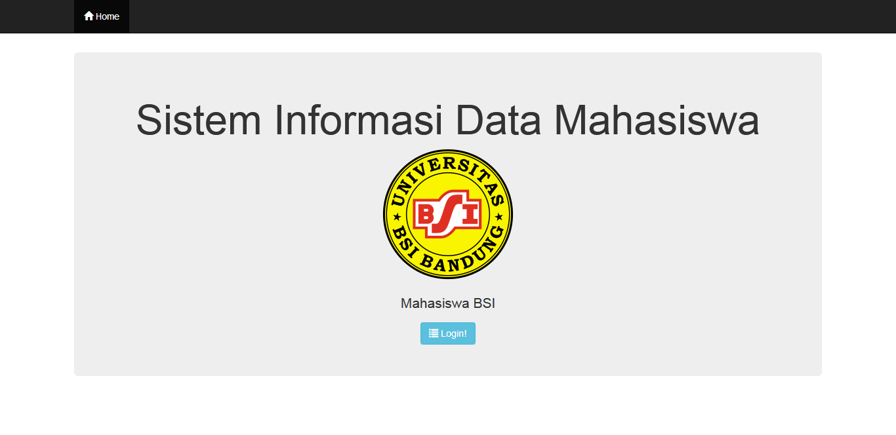
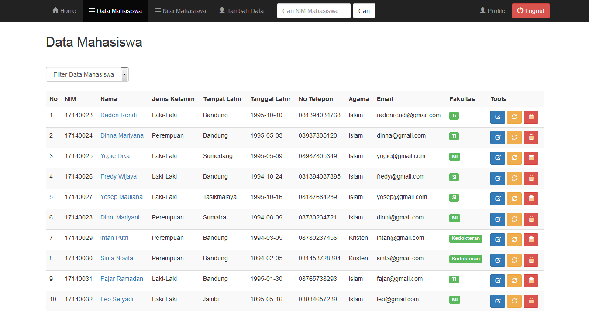
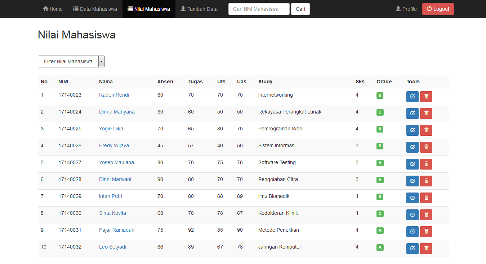

# Sistem Informasi Data Mahasiswa
Tugas Pemrograman Web Buat Sistem Informasi Data Mahasiswa  
Nama : Raden Rendi Cipta K.a 
Nim  : 17140023 
Kls  : 17.8A.33 
 
 
 
 
 
 
 
# Fitur
1. Login Data Admin Dan User
2. Tambah Data, Hapus Data Dan Update Data
3. Tabel Data Mahasiswa Dan Tabel Nilai Mahasiswa
